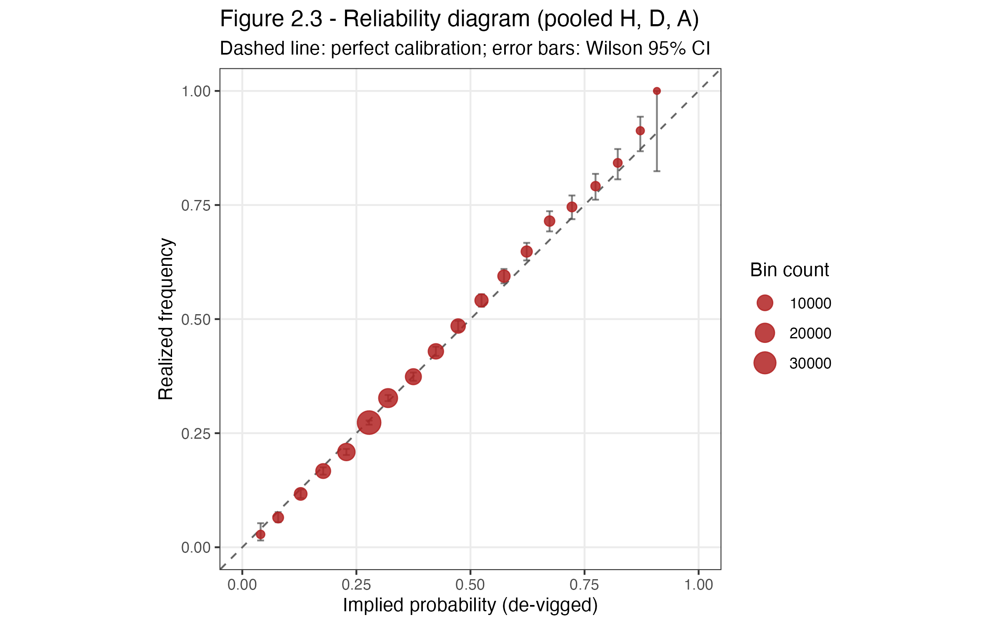
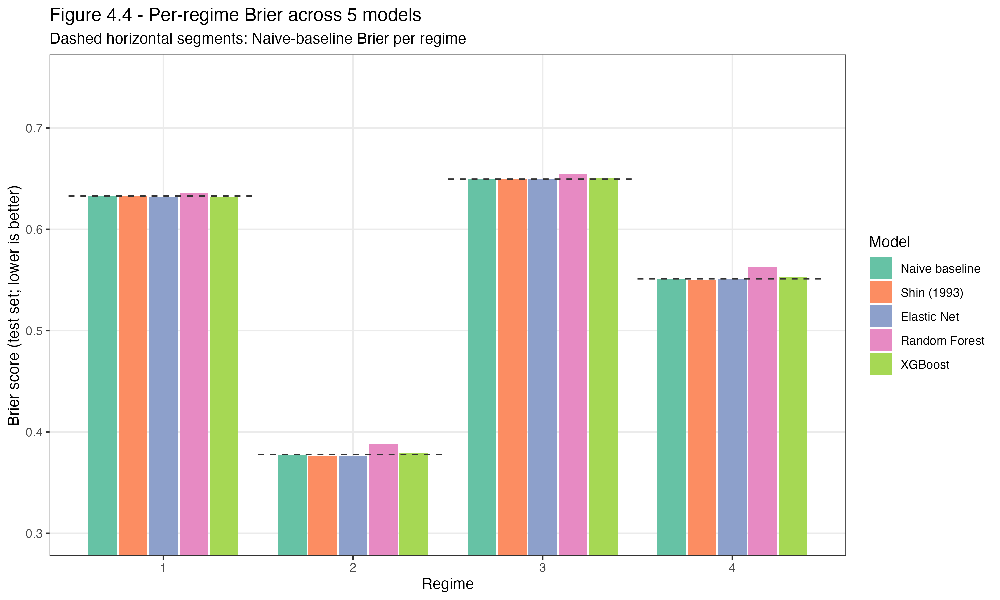
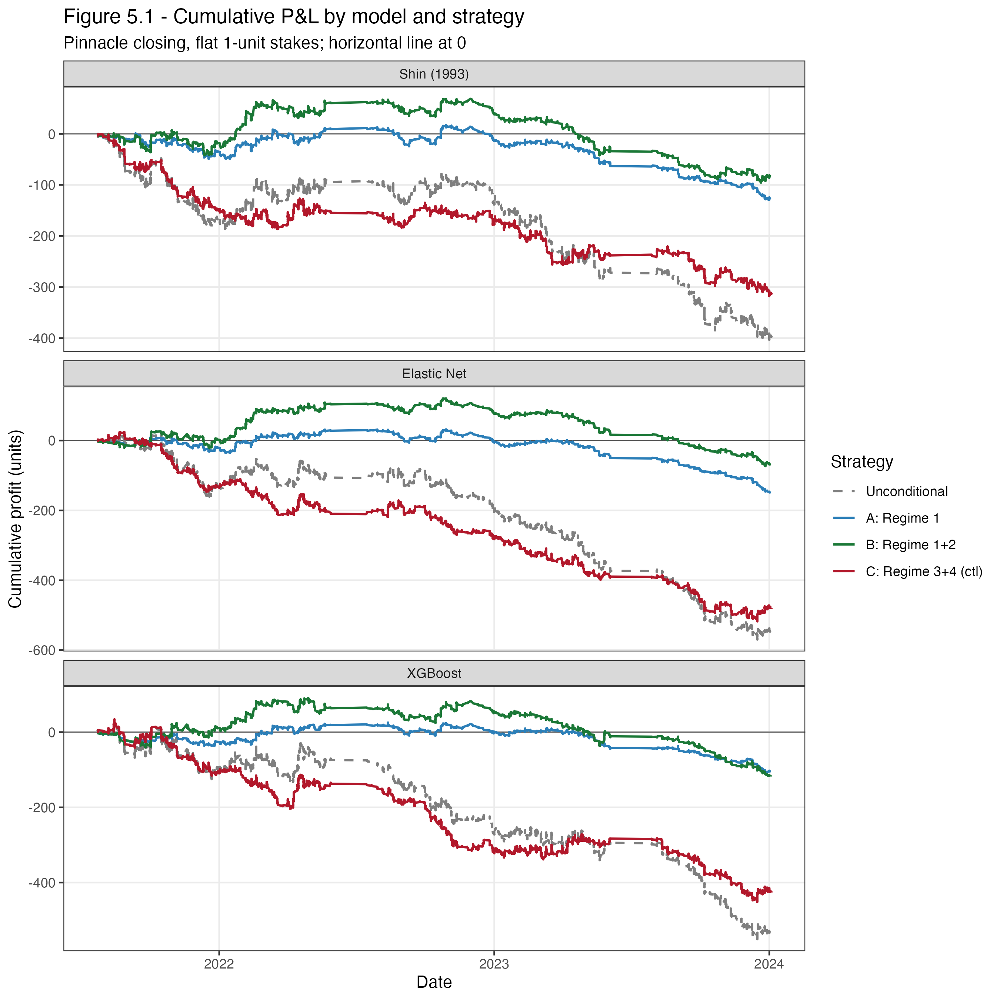

# STAT432 Project — Machine Learning for the Favourite–Longshot Bias (FLB)

Can parametric and non-parametric ML methods identify and exploit the Favourite–Longshot
Bias (FLB) in bookmaker odds, and can they outperform traditional implied-probability
baselines (Shin, Power, basic normalization)?

**Course:** STAT 432, Spring 2026, UIUC
**Author:** Yicheng (Ethan) Yang

## Status

Pipeline complete. All 16 numbered R scripts (`R/00_setup.R` through
`R/15_sensitivity.R`) execute end-to-end from a single raw-data dependency
(`data/full_dataset.csv`). Headline findings and figures are summarised below.
Final report write-up is in progress in `report/`.

## Research Questions & Headline Answers

1. **Unsupervised structure (RQ1).** Can PCA / K-means on cross-bookmaker odds
   reveal latent market regimes, and does FLB severity differ across regimes?
   → **Yes.** Three principal components explain **87.4 %** of variance in 9
   market-shape features. K-Means with **K\* = 4** (silhouette-selected) splits
   the market into a high-disagreement "Wild West" regime, a strong
   home-favourite regime, an away-leaning regime, and a moderately home-leaning
   regime. Per-regime reliability slopes range from **1.069 to 1.151**,
   confirming that FLB severity is non-uniform.
2. **Predictive modelling (RQ2).** Can parametric and non-parametric ML
   (Elastic-Net multinomial logit, Random Forest, XGBoost) outperform Shin /
   naive de-vigged baselines on Brier, log-loss, and calibration?
   → **Barely, and only conditionally.** Pooled test Brier is essentially
   identical across models (0.600–0.608). Random Forest wins calibration
   (slope **1.027** vs naive 1.098). On **Regime 1 only**, both XGBoost
   (+0.21 %) and Elastic Net (+0.13 %) beat both baselines on Brier; on
   Regimes 3 and 4 no ML model beats Shin.
3. **Economic value (RQ3).** Does an ML-based betting strategy achieve
   positive ROI against Pinnacle closing odds (flat stake + quarter-Kelly
   sensitivity)?
   → **No.** All 12 (model × strategy) cells are negative at Pinnacle closing.
   Best case is Elastic Net / Regime 1+2 at ROI = **−3.10 %**. Quarter-Kelly
   sizing lifts every cell uniformly by ~+1.5 pp but no cell flips positive.
   The 2021/22 season is mildly profitable for all three models
   (ROI = +1 % … +3 %) before decaying in 2022/23 and 2023/24.

## Key Figures

### FLB exists in the pooled sample (Figure 2.3)



*Realised frequency vs de-vigged implied probability, pooled across H / D / A
over 42,536 matches. The fitted slope of 1.079 sits above the 45° line at high
probabilities and below at low probabilities — the classic FLB signature.*

### ML helps only in the high-disagreement regime (Figure 4.4)



*Test-set Brier for 5 predictors across the 4 K-Means regimes. Dashed segments
mark the Naive baseline per regime. XGBoost sneaks under the dashed line only
in Regime 1 (the high-book-disagreement "Wild West"). Regime 2 is a
low-Brier regime because strong home favourites are easy to forecast.*

### No economic edge at Pinnacle closing (Figure 5.1)



*Cumulative profit under flat 1-unit stakes, one panel per model. Every
strategy bleeds over the full test window. The best curve is Strategy B
(Regime 1 + 2) for Elastic Net, which stays near break-even for ~18 months
before decaying. The control strategy (Regimes 3 + 4, red) behaves almost
identically to Unconditional — as expected.*

## Dataset

- Source: [Football-Data.co.uk](https://www.football-data.co.uk/)
- 68,359 matches from 11 European leagues, July 2005 – April 2026
- 198 columns: full-time result (FTR), match statistics, 1X2 odds from multiple books
- **Analysis window:** 2013/14 – 2024/25. After restricting to matches with
  complete 1X2 odds from all six target bookmakers (Bet365, Bwin, Interwetten,
  William Hill, VC Bet, Pinnacle closing), the sample is **42,536 matches**
  across 11 leagues. After adding a 10-match team-form history requirement,
  the modelling sample drops to **36,220** (train = 26,153 / test = 10,067).
- **Leakage guard:** in-game statistics (shots, corners, cards, HT score) are
  available only post-match and are excluded from all predictive models via an
  explicit **pre-match feature whitelist**. The one post-match statistic
  allowed — `HST` / `AST` — is used **only as a rolling historical feature of
  past matches**, never from the current match.

Data is **not** committed to the repo (file size + redistribution). See
[`data/README.md`](data/README.md) for how to fetch `full_dataset.csv`.

## Pipeline Overview

16 numbered R scripts under `R/`, plus 3 Python table renderers under
`R/table_renderers/`. Each script is self-contained: it reads only from
`data/` (produced by earlier scripts) and writes to `data/`, `results/`, or
`tables/`.

| # | Script | Produces |
|---|---|---|
| 00 | `R/00_setup.R` | Filter raw CSV → `analysis_sample.rds` |
| 01 | `R/01_eda.R` | Section 2 EDA (overround, pooled reliability, heterogeneity, cross-book disagreement) |
| 02 | `R/02_regime_features.R` | 9 market-shape features (p_fav, entropy, disagreement, …) |
| 03 | `R/03_pca.R` | PCA scree + loadings (train only) |
| 04 | `R/04_kmeans.R` | K-selection, K\* = 4, cluster profiles |
| 05 | `R/05_hclust.R` | Ward linkage, ARI vs K-Means |
| 06 | `R/06_regime_flb.R` | Per-regime reliability diagrams |
| 07 | `R/07_teamform.R` | 28 rolling team-form features with anti-leakage checks; standardised train/test matrices |
| 08 | `R/08_baselines.R` | Naive + Shin (1993) de-vigging |
| 09 | `R/09_elasticnet.R` | `cv.glmnet` multinomial Elastic Net |
| 10 | `R/10_randomforest.R` | `ranger` probability forest + importance |
| 11 | `R/11_xgboost.R` | `xgb.cv` + `xgb.train` + Gain importance |
| 12 | `R/12_per_regime_eval.R` | Overall + per-regime evaluation tables / figures |
| 13 | `R/13_betting_strategies.R` | Bet ledgers at Pinnacle closing + unconditional ROI |
| 14 | `R/14_pnl_and_tables.R` | Regime-conditional strategies, cumulative P&L, headline table |
| 15 | `R/15_sensitivity.R` | EV threshold / odds source / per-season / quarter-Kelly |

All train / test splits are **strictly chronological** (train = 2013/14 – 2020/21,
test = 2021/22 – 2024/25), and every PCA / K-Means / Ward fit is trained on
the training window only — test rows are assigned to regimes by projection
onto train-fitted axes + nearest-centroid snapping.

## Repository Layout

```
stat432-flb-ml/
├── data/              # raw + processed data (gitignored)
├── notebooks/         # exploratory + narrative notebooks (.Rmd / .ipynb)
├── R/                 # 16 numbered R scripts + README + table_renderers/
├── src/               # Python source (optional, for XGBoost/SVM if needed)
├── results/           # key figures committed; full outputs gitignored
├── report/            # final write-up (.Rmd / .tex / .pdf)
├── tests/             # unit tests for preprocessing + leakage guard
├── requirements.R     # one-line installer for all R packages
└── README.md
```

## Reproducing

```bash
# 1. Fetch data into data/ (see data/README.md)
# 2. Install R packages
Rscript requirements.R

# 3. Run the full pipeline in numeric order
cd R && for s in *.R; do Rscript "$s"; done

# 4. (optional) Render the three styled table PNGs
cd R/table_renderers
python3 render_table_2_1_sample_by_league.py
python3 render_table_4_7_per_regime.py
python3 render_table_5_2_regime_strategies.py
```

`set.seed(441)` is preserved in every script with randomness, so outputs are
bit-for-bit identical across runs.

## References

- Cain, M., Law, D., & Peel, D. (2003). *The favourite–longshot bias, bookmaker margins and insider trading.* Applied Economics.
- Shin, H. S. (1993). *Measuring the incidence of insider trading in a market for state-contingent claims.* Economic Journal.
- Štrumbelj, E. (2014). *On determining probability forecasts from betting odds.* International Journal of Forecasting.

## License

MIT — see [LICENSE](LICENSE).
